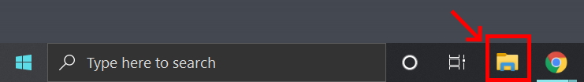
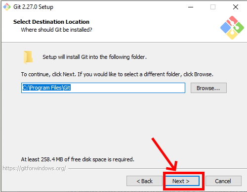
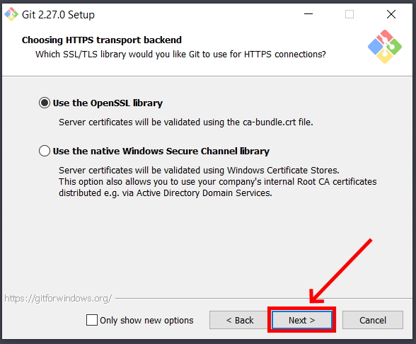
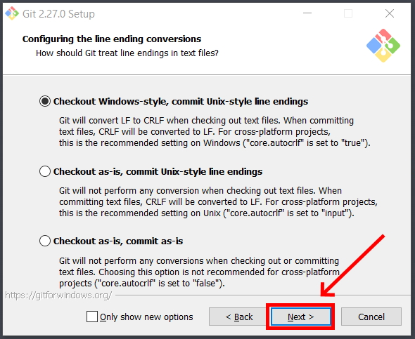
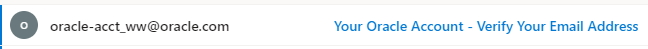
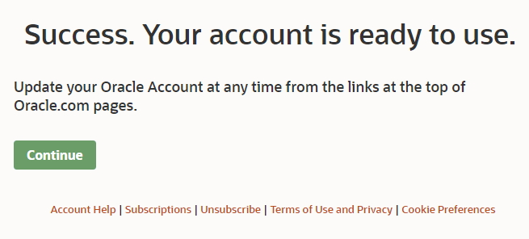
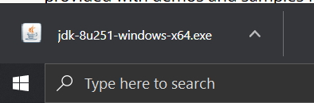
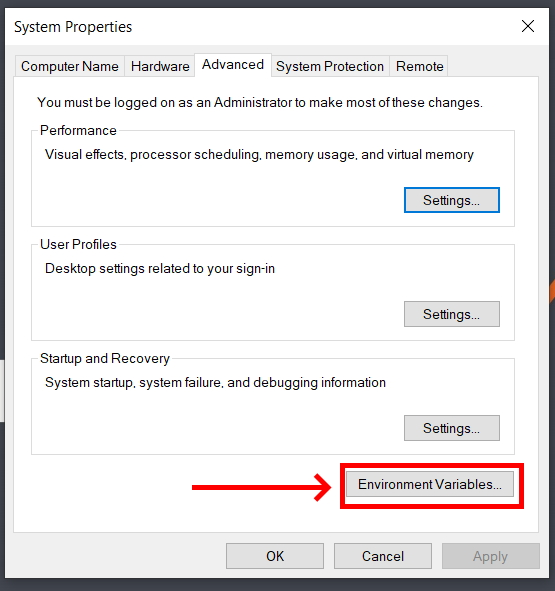
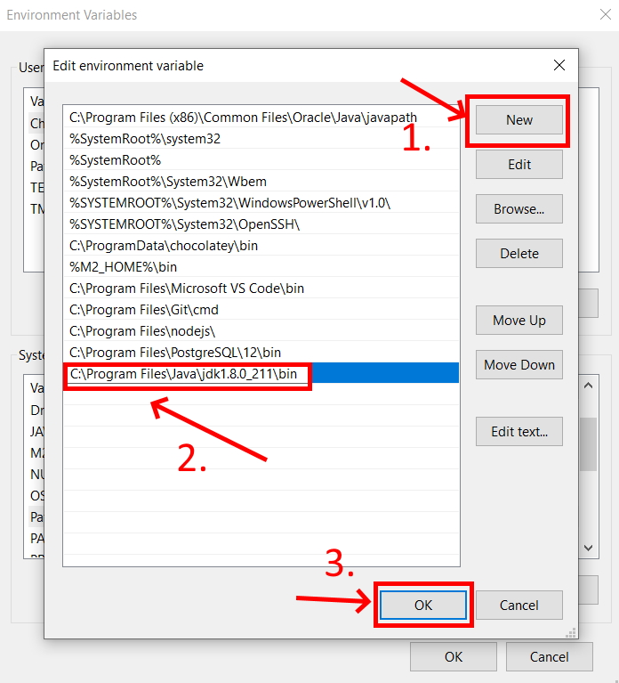
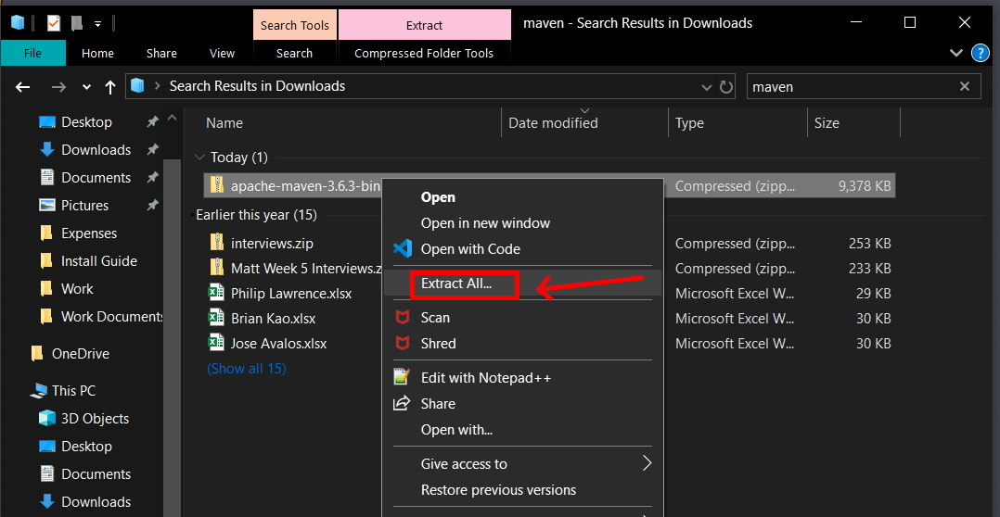

# Environment Setup Guide
---

## Purpose
> This document provides a list of the required technologies. It details why each technology is required and provides some step-by-step instructions on how to install and configure the technologies. This guide also walks you through any needed environment setup.

**NOTE**: It is VERY important that you install these technologies before training begins as we will not have much time to devote to environment setup due to the volume of content we'll cover. It is also important that you install the correct versions of the tools listed here as not all versions of the technologies we will use are guaranteed to be compatible with each other. If you choose to use a different version of one of the tools listed here, you will be responsible for debugging issues that are specific to your version.

## Required Technologies

The following technologies are required in order to complete this phase of the program:

- **Git**: We'll be using Git as a version control tool during the course of this program. Not only will you use Git to track changes to your projects, but you'll also use it to collaborate with your trainer and with your fellow associates.
- **Python**: We will be installing CPython, an interpreter that is used
to run Python code that we will write. This is the official interpreter found on the https://www.python.org/ website
- **PyCharm**: We will be using PyCharm as our *integrated development environment* (IDE) for Python. Though you don't need an IDE to write code, an IDE provides several features that make rapid development (e.g. quickly writing and refactoring code) easier.
- **PostgreSQL**: PostgreSQL is an open source relational database. We will leverage this technology in order to persist and organize data.
- **DBeaver**: DBeaver is a free, open source universal database tool that is compatible with several external data sources, one being Postgres. We'll use DBeaver in order to modify our databases and persist data using a simple user interface provided to us by the tool.
- **Postman**: Postman is used for testing RESTful APIs. We'll use it to set up collections of tests for the RESTful APIs we design throughout the program. It can also be used to quickly test a single endpoint.
- **Visual Studio Code**: Visual Studio Code is a text editor that makes viewing and modifying code simple. Do not confuse this tool with an integrated development environment as it does not come equipped with all of the development tools you typically find in an IDE.
- **Java SE Development Kit 8**: We will be utilizing Java 8 towards the second half of our training. This software development kit will provide the compiler and runtime environment needed to quickly and efficiently develop Java applications. Please uninstall any other Java versions if it is there in your machine please as it would cause trouble later.
- **IntelliJ**: We will be using IntelliJ as our *integrated development environment* (IDE) for Java. This looks very similar to PyCharm as they are both developed by a company called JetBrains
- **Maven**: Maven is a software project management and build automation tool. We will use it to manage our projects' builds as it provides dependency management and streamlines several aspects of the testing life cycle.

## Installation Steps
This method is compatible with all environments as it does not require any platform-specific package managers. You need only visit the official websites for each of the technologies listed and download the version of the tool that is compatible with your system.

Do note, however, that setting system environment variables differs from machine to machine. This guide shows how to set environment variables on a Windows machine.

The first thing you'll want to do is open your web browser of choice. This guide will use *Chrome*.

**Note**: Many of the tools that you will install have different system installers that are platform dependent. It is **very** important that you download the correct installer. The following list details how you should choose the installer for a program:

- If you have a 32-bit version of Windows, use the installer that is marked as the 32-bit version.
- If you have a 64-bit version of Windows, use the installer that is marked as the 64-bit version.
- If you have a Linux distribution (e.g. Debian, Ubuntu, Red Hat, Fedora), you should choose the installer that matches your distribution.
- If you have a Mac, you should choose the installer that is marked as the Mac installer.

These options will be clearly labeled on the websites you visit to download the technologies. If you're not sure how to figure out what version of the Windows operating system you're running, do the following:

1. Type "Control Panel" into the Windows search bar and click on the "Control Panel" app.
2. Select "System and Security".
3. Select "System".

You should now see the following screen:

You should see your operating system listed ("Windows 10" in the above example) and the system type listed under the "System" tab (a 64-bit operating system in the above example).

### Install Git

1. Navigate in your browser to [Git's Website](https://git-scm.com/download) and click the latest download for Windows. (For those using a different OS click the appropriate OS and look for the most recent stable release.)

 

2. Click yes to any security/firewall popup asking if you are sure you want to download the file. 

3. The install file will begin downloading; most browsers will show the file that has just downloaded, click that file when it completes. If you do so skip to step 6. If the download is not apparent on your browser or disappears upon finishing go to step 4. 

4. If you were not able to click the install exe file you just downloaded in your browser open your file explorer.

5. In the window that opens click the "Downloads" folder, use the search bar in the upper right to search "git", and then double click on the Git installer exe file.

6. Click yes to any security pop-ups asking you if you want to allow the installer to make changes to your computer. 

7. The install wizard will open to guide you through the process of installing Git. Read the license agreement and click "Next." 

8. Accept the default installation path by clicking "Next."

9. Select your components. It is recommended to add a desktop icon. Leave the other boxes in their default setting. Click "Next."

10. Leave the rest of the set up as the default configuration clicking Next until you get to the experimental options (which you should leave unchecked) and then click Install. This will run the actual install process. 

11. After install you will get a a final window giving you the options to launch Git Bash and view the Readme notes. Select open Git Bash and deselect the view Readme notes. Click "Next."

12. When Git Bash opens type "git --version" and hit Enter. If it return the version of Git you installed it correctly. 

### Install Python

1. Navigate to the Python download page for Python version 3.9 [HERE](https://www.python.org/downloads/release/python-3913/). It is important that you download 3.9, so please check the version carefully

2. Click on the appropriate download for your OS. If you're on Windows, download the 64 bit installer for Windows

3. Navigate to the downloads folder and run the installer

4. Once the installer opens, you should see a list of options. First, check the "Add Python 3.9 to PATH" option and secondly, click "Install Now"

5. Once Python is done installing, search for command prompt in the search bar if you're on Windows. Open command prompt

6. Type in `python --version` and press enter. You should see Python 3.9.13 be printed out to the screen

### Install PyCharm

1. Navigate to the [PyCharm website](https://www.jetbrains.com/pycharm/) and click on the download button in the center of the page

2. Select the appropriate OS option depending on the OS you are using for your computer. Click on the download button for "Community" edition

3. Navigate to your downloads, find the PyCharm installer and run it

4. Click on next until you reach the following screen. Check the 3 options and then click next

5. Click install and wait for the installation process to finish

6. You will be asked if you would like to reboot your PC to finish the installation of PyCharm. For now, you can select that you want to manually reboot later. Remember, however, to reboot your PC after you're done installing all of the other software to ensure that everything works properly

### Install Postgres

1. Navigate to the [Postgres website](https://www.postgresql.org/download/) and select the appropriate operating system

2. Click on "Download the installer"

3. Select the appropriate latest download for your OS

4. Once the download is complete, check your downloads folder and run the installer

5. Click next through the prompts

6. Choose a password that you will REMEMBER! This is important in order to connect to the database later in training. If you forget the password, you will need to uninstall and reinstall Postgres again

7. Keep the port as the default (5432) and begin the installation

8. When you reach the own, uncheck "Launch Stack Builder at exit" and click finish

### DBeaver

1. Navigate to the [DBeaver website](https://dbeaver.io/download/) and ensure that you download the **Community Edition** of DBeaver

2. Run the installer and click through the prompts. When you reach the options, choose the following

3. Go through the rest of the installation process

### Install Postman

1. Navigate to the [Postman website](https://www.postman.com/downloads/)

2. Go to the downloads folder and run the installer

3. Go through the installation process. Postman should then open up

### VS Code

1. Navigate to the [Visual Studio Code website](https://code.visualstudio.com/) and click on the appropriate download link

2. Go to the downloads folder and run the installer

3. Go through the installation process and check the following options when prompted

### Install Java
1. Navigate in your web browser to [Oracle's JDK 8](https://www.oracle.com/java/technologies/javase/javase-jdk8-downloads.html?) website. NOTE: If you are experiencing errors when trying to load the webpage try another browser. If you still are having trouble, try again later. 

2. In the top right of the website click "View Accounts" and then "Create an Account." (If you already have an Oracle account you can just skip to step 5)

3. Fill in the form with your information (you may type "none" for Company Name) and then click the "Create Account" button. 

4. Check your e-mail account for a new message from Oracle. (This may take a few minutes.) When you receive the e-mail open it and click the "Verify Email Address" button inside. This should direct you to a success screen. 

5. Return to [Oracle's JDK 8](https://www.oracle.com/java/technologies/javase/javase-jdk8-downloads.html?) website. Scroll to find the appropriate JDK for your Operating System and Architecture. (Windows 10 will be Windows x64 as shown below) and click to download. 

6. A popup will ask you to review the license before continuing. Do so and click the check box and then the download button.

7. If you are not signed in a pop will appear asking you to do so. Enter your sign in information (your e-mail is your user name) and submit. The download should then begin. 

8. Once the download is complete, click the file that downloads in your browser to open it and skip to step 11. If you do not see the file in your browser then proceed to step 9 to find it in your downloads folder. 

9. If you could not open the JDK installer from your browser open your file explorer. 

10. In the window that opens click the "Downloads" folder, search (in the top right) for "jdk" and double click the jdk installer.

11. The installer will inform you that the license has been updated from previous versions. Review the license if you have not already and click next. 

12. The installer will continue and you should just accept the default setup. IMPORTANT: Make note of the file path for the installation directory! You WILL need this later. Click "Next."

13. The install will begin extracting files and will ask to confirm the installation directory of the JRE. Confirm the default directory by clicking "Next."

14. Java will finish installing and you can then click "Close."

15. Use your system search tool (next to the windows button) to look for "Edit the system environment variables" in the control panel. Be sure that you open the SYSTEM environment not the ones just for your account. 

16. Click the "Environment Variables" button in the window that opens.

17. Under "System Variables" click the "New" button. 

18. Name the new variable "JAVA_HOME" and give it the value of the directory where your JDK was installed to. (See Step 12.) If you are unsure of your directory path you can go to C:\Program Files\Java in your file explorer then click on the JDK folder to open it. You can then copy the path from the navigation bar at the top of the file explorer. 

19. In your system variables then select the "Path" variable and click "Edit."

20. Click "New" to create a new line. Add the path to the JDK bin folder in this line, it will be the same as the path in JAVA_HOME with a "\bin" at the end. 

21. Click "OK" to close the Environment Variables window. 

22. Open Git Bash, type "java -version" and hit Enter. If the JDK is installed correctly you should see Java with the version number you downloaded. 

### Install IntelliJ

1. Navigate to the [IntelliJ website](https://www.jetbrains.com/idea/download/) and click on the **Community Edition** download

2. When it is done downloading, go to your downloads folder and double-click on the installer

3. Click next on the following prompts

4. Once you get to this prompt, check all of the options as follows

5. Once you reach the end of the installation, choose "I want to manually reboot later" 

### Install Maven

1. Navigate in your web browser to the [Maven Download Page](https://maven.apache.org/download.cgi) and scroll down to the "Files" section. Click the Binary zip archive link to download. Approve any firewall/security popups asking if you are sure you want to download the file. 

2. The download should appear in your browser. When it completes right-click and click "Show in folder." Skip to step 4. If you were unable to right-click and show in folder proceed to step 3. 

3. If you could not open the file location from your browser, open your file explorer, click downloads, and search "maven" in the upper right search bar. You should see the file you just downloaded. 

4. Right click the Maven zip archive you just downloaded and click "Extract All..."

5. Your extraction wizard will open. Set the file path to "C:\Maven" and click the box to show extracted files when complete. Then click "Extract."

6. Your file will be unzipped and your file explore will open a window to C:\Maven containing the folder with your maven version. Double click to open that folder. 

7. Now inside the versions specific folder, click the navigation bar and the top and copy the file path. You will need this for your environment variables. 

8. Use your system search tool (next to the windows button) to look for "Edit the system environment variables" in the control panel. Be sure that you open the SYSTEM environment not the ones just for your account. 

9. Click the "Environment Variables" button in the window that opens.

10. Under "System Variables" click the "New" button. 

11. Name the new variable "M2_HOME" and give it the value of the file path you copied in step 7. Then click "OK."

12. Click the new button again. Give the variable the name "M2" and the file path "%M2_HOME%\bin" then click "OK."

13. In your system variables then select the "Path" variable and click "Edit."

14. Click new to open a new line and type in "%M2%" then click "OK."

15. Click "OK" to close the Environment Variables window. 

16. Open Git Bash and type "mvn -v" then hit Enter. If that returns the maven version you have it set up correctly. 

